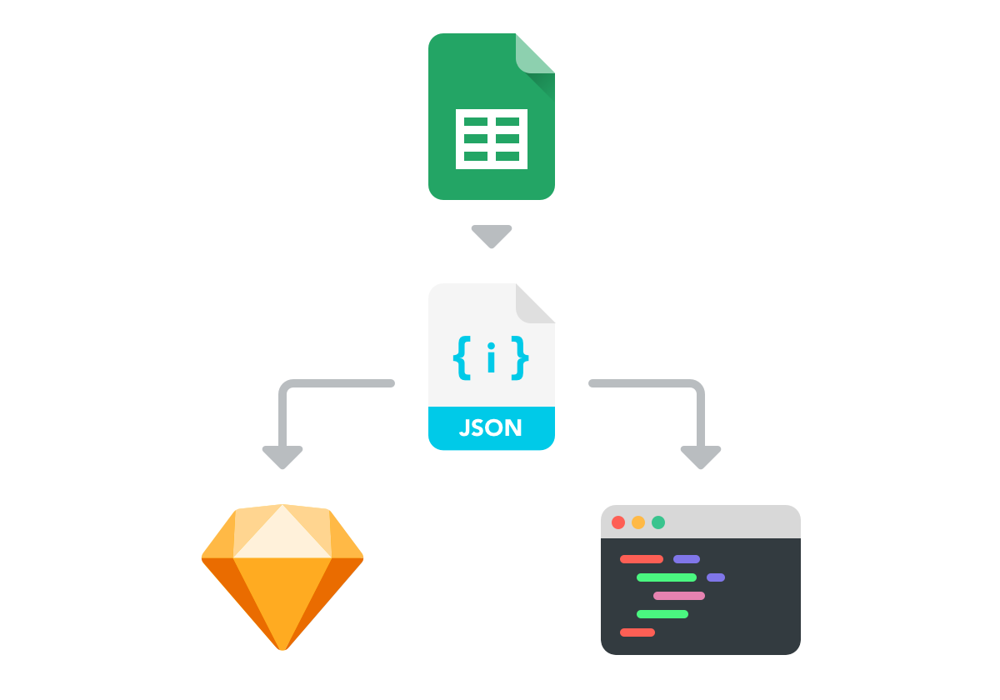

# Translate - Sketch plugin
A sketch plugin to translate copy content into iOS and Android ready locale file.

To compile the tool
1. cd sketch-translate-mac
2. carthage bootstrap --platform mac --use-ssh
3. compile via Xcode

## How it works
* **Step 1** Manage copy in a Google Sheet
* **Step 2** Export the Spreadsheet on a JSON file
* **Step 3** Import to Sketch / Xcode / Android Studio

